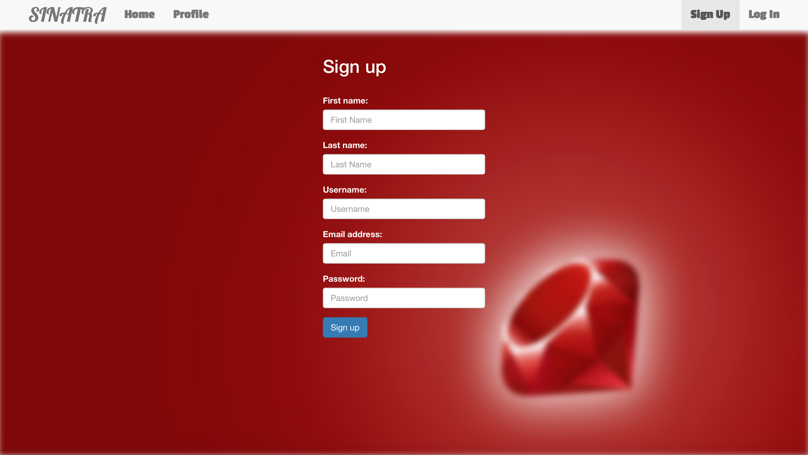

# SINATRA-ASSESSMENT




RUN:
bundle exec thin start

VISIT:
http://0.0.0.0:3000/

TEST ACCOUNTS:

1. gordon/123

2. user1/123

## Description

This is my SINATRA assessment. The main purposes of this assessment are to practice CRUD, session authorization, model associations, bootstrap, CSS&HTML, and real-time messaging that I added for fun.

There are three resources: channel, post, user

#### User:

Users can create new accounts in sign up page. When signing up a new account, the email and username must be unique. Also, users must log in in order to use this app.

#### Channel:

For the channel part, users can see all the channels including the one created by other users. Users are able to create their own channel. By clicking join button, users can get into the channel and see the posts created only within this channel. 

#### Post:

For the post part, posts can only be seen in the channel it belongs to. Users are able to edit and delete posts created by their own. At the bottom of the posts column, users can create new post, and publish it in the channel they are in. 

#### Message:

For message part, I used Pusher gem to implement real-time messaging. The message is a global message. All users are able to see all the messages without joining a channel.

#### How to implement real-time messaging with SINATRA:

Register on Pusher website for the keys and config the Pusher:

```
Pusher.app_id = '...'
Pusher.key = '...'
Pusher.secret = '...'
```

Add a script in order to add message div onto the view:

```
<script type="text/javascript">
  $(document).ready(function() {
    var pusher = new Pusher('34b83dc670b5cd1b896e');
    var channel = pusher.subscribe('test_channel');
    channel.bind('new_message', function(data) {
      $('.messages').append("<div class=\"message\">" + "From @" + data.user + "--->" + data.message + "</div>");
    });
    Pusher.log = function(message) {
      if (window.console && window.console.log) window.console.log(message);
    };
    $("#message_form").submit(function(e) {
        e.preventDefault();
        $.post('/channel', $(this).serialize(), function() {
            $("#message_form input").val('');
        });
    });
  });
</script>
```

Execute trigger method to broadcast the messages in the controller:

`Pusher['test_channel'].trigger('new_message', :message => params['message'], :user => user.to_s)`
